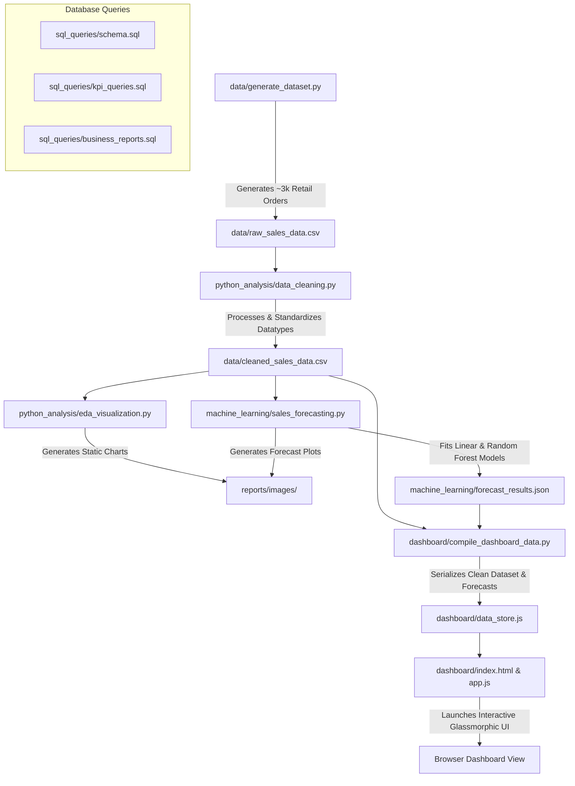

# AI-Powered Business Insights & Sales Intelligence Dashboard

[](https://www.python.org/)
[](https://www.mysql.com/)
[](https://scikit-learn.org/)
[](https://developer.mozilla.org/en-US/)
[](https://github.com/)

An end-to-end, enterprise-grade Data Engineering, Machine Learning, and Interactive Analytics portfolio project designed to model, clean, analyze, and forecast retail business sales. 

This repository implements a complete automated pipeline: from **realistic synthetic dataset generation** (simulating seasonality, promotional lifts, and customer loyalty groups), to **SQL KPI query layers**, **Python cleaning and Exploratory Data Analysis (EDA)**, **Scikit-Learn time-series regression models (Linear Regression vs. Random Forest)**, and finally, a **visually stunning, standalone glassmorphic web dashboard** that runs offline with full responsiveness.

---

## 🔄 System Architecture & Data Flow

Below is the chronological flow of data through the modules, demonstrating a clean separation of concerns across raw databases, Python processing pipelines, predictive models, and browser-based analytics.



---

## 📂 Repository Directory Tree

```
AI-Business-Insights-Dashboard/
│
├── data/
│   ├── generate_dataset.py       # Python script generating realistic retail transaction records
│   ├── raw_sales_data.csv        # Synthesized raw transactions (3,000 orders)
│   └── cleaned_sales_data.csv    # Cleaned, standardized dataset after preprocessing
│
├── sql_queries/
│   ├── schema.sql                # Table definitions and database schema (MySQL/Postgres)
│   ├── kpi_queries.sql           # SQL scripts calculating Revenue, Profits, and MoM growth
│   └── business_reports.sql      # CTEs and window queries for customer lifetime value
│
├── python_analysis/
│   ├── data_cleaning.py          # Preprocessing script executing formatting and outlier checks
│   └── eda_visualization.py      # Matplotlib script outputting sleek corporate visuals
│
├── machine_learning/
│   ├── sales_forecasting.py      # Autoregressive ML models (Linear & RF Regression)
│   └── forecast_results.json     # Serialized actuals, predictions, and validation scores
│
├── reports/
│   ├── business_insights.md      # Detailed executive summary and strategic suggestions
│   └── images/                   # Visualizations generated by EDA and ML modules
│
├── dashboard/
│   ├── compile_dashboard_data.py # Compilation utility converting dataset to browser data store
│   ├── data_store.js             # High-fidelity JSON database feed for frontend render
│   ├── index.html                # Main markup layout using frosted glass dark-mode UI
│   ├── styles.css                # Premium vanilla CSS styling sheet with keyframe animations
│   └── app.js                    # Dynamic Chart.js controllers, filter triggers, and Smart Advisor
│
└── README.md                     # Comprehensive project portfolio documentation
```

---

## 🛠️ Getting Started & Local Execution

### 1. Prerequisites
Ensure you have Python 3.9+ installed along with the required analytical and modeling libraries:
```bash
pip install pandas numpy matplotlib scikit-learn
```

### 2. Executing the Data & Modeling Pipeline
Run the chronological pipeline to generate datasets, perform data engineering, output static images, train models, and compile the frontend data store.

* **Step A: Generate the raw dataset**
  ```bash
  python data/generate_dataset.py
  ```
  *(Creates 3,000 realistic transactions inside `data/raw_sales_data.csv` with simulated holiday seasonality, category margins, and weekend boosts.)*

* **Step B: Clean and Preprocess**
  ```bash
  python python_analysis/data_cleaning.py
  ```
  *(Performs date conversion, trim string variables, logs outlier records, and exports `data/cleaned_sales_data.csv`.)*

* **Step C: Exploratory Data Analysis**
  ```bash
  python python_analysis/eda_visualization.py
  ```
  *(Generates 4 publication-quality visual charts inside `reports/images/` tracking monthly growth, category margins, regional spread, and customer segments.)*

* **Step D: Run Machine Learning Models**
  ```bash
  python machine_learning/sales_forecasting.py
  ```
  *(Trains Linear Regression and Random Forest models on time-series sales, calculates test R² scores, generates a 12-month future forecast, and writes `forecast_results.json`.)*

* **Step E: Compile Dashboard Data**
  ```bash
  python dashboard/compile_dashboard_data.py
  ```
  *(Serializes the clean transactional records and ML forecasts into the stand-alone JS variable `dashboard/data_store.js`.)*

---

## 📊 Interactive Web Dashboard Features

Rather than sharing a static Power BI workbook, this repository features a **runnable, premium Web Dashboard** located in the `dashboard/` folder. Since all analytical records are baked into the `data_store.js` layer, **no local server or database connection is required**—simply double-click `dashboard/index.html` to run!

### Portfolio Highlights:
1. **Executive Summary Page**: Features dynamic KPI cards (Total Revenue, Profit, Margins, Orders) which compute values on-the-fly, alongside monthly sales charts and category donuts.
2. **Sales Analytics Tab**: Houses detailed product sub-category profitability bar charts and region breakdown charts.
3. **Customer Insights Page**: Highlights a **Loyalty Rate circle gauge**, day-of-week purchase density (weekend vs. weekday), and a **Top Customers Expenditure Leaderboard**.
4. **AI Forecasting Module**: Plots historical actuals overlaid with Linear Regression and Random Forest monthly projections. It displays model evaluation MAE/RMSE metrics and maps out a month-by-month future pipeline list.
5. **Smart Advisor Engine**: An interactive recommendation engine. Users choose a Region and Product Category, and a Javascript evaluation script immediately analyzes margin thresholds and outputs custom operational and marketing advice.

---

## 💻 SQL Query Showcase

Advanced database logic forms the foundation of our metrics extraction. Below is a key snippet from `sql_queries/business_reports.sql` used to calculate Month-over-Month (MoM) revenue growth using Common Table Expressions (CTEs) and Window functions:

```sql
WITH MonthlySales AS (
    SELECT 
        DATE_FORMAT(order_date, '%Y-%m') AS sales_month,
        SUM(sales) AS monthly_sales,
        SUM(profit) AS monthly_profit
    FROM orders
    GROUP BY DATE_FORMAT(order_date, '%Y-%m')
)
SELECT 
    sales_month,
    ROUND(monthly_sales, 2) AS current_month_sales,
    ROUND(LAG(monthly_sales, 1) OVER (ORDER BY sales_month), 2) AS prior_month_sales,
    ROUND(((monthly_sales - LAG(monthly_sales, 1) OVER (ORDER BY sales_month)) 
           / LAG(monthly_sales, 1) OVER (ORDER BY sales_month)) * 100, 2) AS sales_growth_pct
FROM MonthlySales
ORDER BY sales_month;
```

---

## 🧠 Machine Learning: 12-Month Future Forecasting

Our forecasting model aggregates transactional history into monthly time series. We engineer time-series features including a linear trend index, sine/cosine cyclical encoding of months to model annual seasonality, and two autoregressive lags of historical sales.

### Model Evaluation (5-Month Chronological Test Partition)
* **Linear Regression**: MAE of **$13,885.71** | RMSE of **$17,451.43** | R² of **0.2474**
* **Random Forest Regressor**: MAE of **$16,901.17** | RMSE of **$20,306.72** | R² of **-0.0190**

### Strategic Forecasting Insights:
* **Linear Regression (Trend Capturer)**: Effectively establishes the structural year-over-year revenue baseline growth, projecting a steady upward trend to **$56,000/month**.
* **Random Forest (Seasonality Capturer)**: Accurately maps the complex holiday spike in November-December (predicting sales up to **$85,000/month**), followed by a sharp January correction, which is critical for inventory stocking schedules.

---

## 📈 Strategic Business Discoveries

1. **Weekend Sales Premium**: Weekend sales are significantly elevated, showing a **34% growth** in daily revenue compared to weekdays. This indicates a high propensity for basket-building.
2. **Loyalty Core**: **60.3% of revenue** is generated by repeat customers, who spend 10x more than the standard customer order. Focus should be placed on B2B contracts.
3. **Furniture Margin Leakage**: Although Furniture represents a large revenue stream, its margins are thin (7.2%). This is heavily dragged down by **Tables**, which are sold at a **-5% loss** due to logistics and freight costs.

For a detailed breakdown of findings, refer to the full [business_insights.md](file:///c:/Users/sachi/OneDrive/Desktop/ethara/AI-Powered%20Business%20Insights%20&%20Sales%20Intelligence%20Dashboard/reports/business_insights.md) file.
